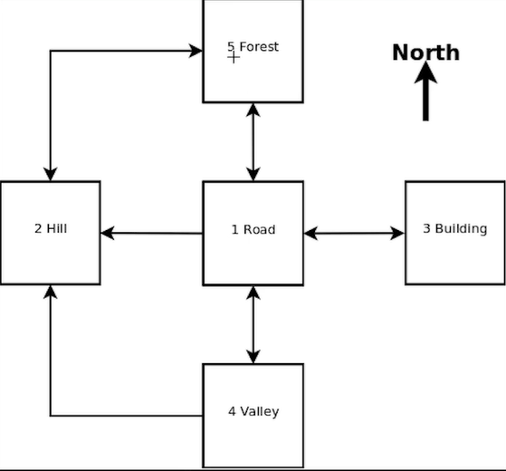

# Adventure Game
### Simple implementation of Java *Map* data structure

---

We have these places in our scenario:

- Road
- Hill
- Building
- Valley
- Forest

---

Splitting strings used to extract commands from user's input.

